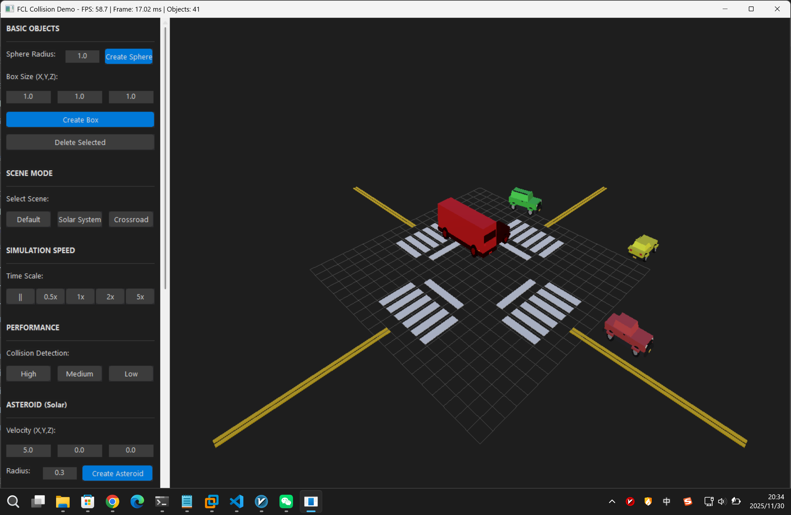

# FCL+Musa

[](LICENSE)
[](https://cmake.org/)
[](https://isocpp.org/)
[](https://www.microsoft.com/windows)

**FCL+Musa** 是一个将 [FCL (Flexible Collision Library)](https://github.com/flexible-collision-library/fcl) 移植到 Windows 内核态和用户态的项目，提供高性能的碰撞检测能力。

## ✨ 特性

- 🚀 **高性能** - 基于FCL的高效碰撞检测算法
- 🔧 **双模式** - 支持内核态（驱动）和用户态（应用程序）
- 📦 **CPM集成** - 通过CMake Package Manager轻松集成
- 🎯 **零外部依赖** - 所有依赖（Eigen、FCL、libccd）已内置
- 🛠️ **现代CMake** - 完整的CMake导出支持
- 📚 **完整文档** - 详细的API文档和示例代码

## 📋 目录

- [快速开始](#快速开始)
- [系统要求](#系统要求)
- [安装方法](#安装方法)
- [使用示例](#使用示例)
- [CPM集成](#cpm集成)
- [项目结构](#项目结构)
- [构建系统](#构建系统)
- [文档](#文档)
- [许可证](#许可证)
- [贡献](#贡献)

## 🚀 快速开始

### 用户态应用（推荐，无需WDK）

```bash
# 克隆仓库
git clone --recursive https://github.com/yourname/FCL+Musa.git
cd FCL+Musa
git submodule update --init --recursive
pwsh tools/scripts/apply_fcl_patch.ps1

# 配置并构建
mkdir build && cd build
cmake .. -G "Visual Studio 17 2022" -A x64
cmake --build . --config Release

# 运行示例
.\Release\FclMusaUserDemo.exe
```

### 内核态驱动（需要WDK）

```bash
# 使用交互式构建菜单
pwsh build.ps1

# 选择 "1. Build" → "R0 Debug" 或 "R0 Release"
```

## 💻 系统要求

### 用户态模式
- **操作系统**: Windows 10/11
- **编译器**: MSVC 2022 或 clang-cl
- **CMake**: ≥ 3.24
- **C++ 标准**: C++17

### 内核态模式
- 上述所有要求 +
- **WDK**: Windows Driver Kit 10.0.22621.0 或更高版本
- **签名**: 测试签名证书（开发环境）

## 📦 安装方法

### 方法1: CPM (推荐)

在你的 `CMakeLists.txt` 中：

```cmake
include(cmake/CPM.cmake)

CPMAddPackage(
  NAME FclMusa
  GITHUB_REPOSITORY yourname/FCL+Musa
  GIT_TAG main  # 建议固定具体 tag
  OPTIONS
    "FCLMUSA_BUILD_DRIVER OFF"
    "FCLMUSA_BUILD_USERLIB ON"
    "FCLMUSA_BUILD_KERNEL_LIB OFF"
  # 可选：拉取后自动套用 external/fcl-source 补丁
  POST_DOWNLOAD_COMMAND
    "${CMAKE_COMMAND}" -E chdir <SOURCE_DIR>/tools/scripts pwsh apply_fcl_patch.ps1
)

add_executable(myapp src/main.cpp)
target_link_libraries(myapp PRIVATE FclMusa::CoreUser)
```

### 方法2: Git Submodule

```bash
git submodule add https://github.com/yourname/FCL+Musa.git external/fclmusa
git submodule update --init --recursive
```

在 `CMakeLists.txt` 中：

```cmake
add_subdirectory(external/fclmusa)
target_link_libraries(myapp PRIVATE FclMusa::CoreUser)
```

### 方法3: 手动构建

参考[构建系统文档](BUILD_SYSTEM.md)。

## 📝 使用示例

### 用户态示例

```cpp
#include <cstdio>
#include <fclmusa/collision.h>
#include <fclmusa/geometry.h>
#include <fclmusa/geometry/math_utils.h>

int main() {
    // 初始化几何体子系统
    FclGeometrySubsystemInitialize();

    // 创建两个球体
    FCL_GEOMETRY_HANDLE sphereA, sphereB;
    FCL_SPHERE_GEOMETRY_DESC descA = {{0.0f, 0.0f, 0.0f}, 0.5f};
    FCL_SPHERE_GEOMETRY_DESC descB = {{0.6f, 0.0f, 0.0f}, 0.5f};

    FclCreateGeometry(FCL_GEOMETRY_SPHERE, &descA, &sphereA);
    FclCreateGeometry(FCL_GEOMETRY_SPHERE, &descB, &sphereB);

    // 碰撞检测
    using fclmusa::geom::IdentityTransform;
    FCL_TRANSFORM poseA = IdentityTransform();
    FCL_TRANSFORM poseB = IdentityTransform();
    poseB.Translation = {0.6f, 0.0f, 0.0f};

    BOOLEAN intersecting;
    FCL_CONTACT_INFO contact;
    FclCollisionDetect(sphereA, &poseA, sphereB, &poseB, &intersecting, &contact);

    if (intersecting) {
        std::printf("Collision detected! Penetration: %.4f\n", contact.PenetrationDepth);
    }

    // 清理
    FclDestroyGeometry(sphereB);
    FclDestroyGeometry(sphereA);
    FclGeometrySubsystemShutdown();

    return 0;
}
```

更多示例请查看 [`samples/`](samples/) 目录。

## 🎯 CPM集成

FCL+Musa 完全支持通过 CPM (CMake Package Manager) 集成。详细文档请参阅 [CPM集成指南](docs/cpm_integration.md)。

### 内核态库

```cmake
CPMAddPackage(
  NAME FclMusa
  GITHUB_REPOSITORY yourname/FCL+Musa
  GIT_TAG main
  OPTIONS
    "FCLMUSA_BUILD_KERNEL_LIB ON"
    "FCLMUSA_WDK_ROOT C:/Program Files (x86)/Windows Kits/10"
    "FCLMUSA_WDK_VERSION 10.0.26100.0"
  POST_DOWNLOAD_COMMAND
    "${CMAKE_COMMAND}" -E chdir <SOURCE_DIR>/tools/scripts pwsh apply_fcl_patch.ps1
)

target_link_libraries(my_driver PRIVATE FclMusa::Core)
```

## 📁 项目结构

```
FCL+Musa/
├─ kernel/                  # 内核态代码（原r0/）
│  ├─ core/                 # 碰撞检测核心算法
│  ├─ driver/               # Windows驱动框架
│  └─ tests/                # 驱动测试
├─ samples/                 # 示例项目
│  ├─ cli_demo/             # 命令行示例
│  ├─ gui_demo/             # GUI示例
│  └─ r3_user_demo/         # 用户态示例
├─ external/                # 外部依赖
│  ├─ Eigen/                # 线性代数库
│  ├─ fcl-source/           # FCL上游源码（锁定 v0.7.0 发布版，构建前自动套用补丁）
│  ├─ libccd/               # GJK/EPA算法
│  └─ Musa.Runtime/         # Musa运行时
├─ tools/                   # 构建工具
│  ├─ build/                # 构建系统脚本
│  └─ scripts/              # 辅助脚本
├─ docs/                    # 文档
├─ tests/                   # 测试
├─ CMakeLists.txt           # CMake配置
├─ build.ps1                # 主构建入口
└─ README.md                # 本文件
```

## 🔧 构建系统

使用交互式PowerShell菜单：

```powershell
pwsh build.ps1
```

菜单选项：
- **Build** - 编译项目（R0驱动、R3库、Demo等）
- **Test** - 运行测试
- **Doc** - 生成文档
- **Check Env** - 检查构建环境
- **Check Upstream** - 检查上游更新

> 提示：`external/fcl-source` 仍指向上游 FCL 仓库，内核模式所需的改动保存在 `patches/fcl-kernel-mode.patch`，可通过 `pwsh tools/scripts/apply_fcl_patch.ps1` 一键应用，`build.ps1` 会在构建前自动执行该脚本。

详细说明请参阅 [BUILD_SYSTEM.md](BUILD_SYSTEM.md)。

## 📚 文档

- [构建系统](BUILD_SYSTEM.md) - 详细的构建指南
- [CPM集成](docs/cpm_integration.md) - CPM使用方法
- [架构设计](docs/architecture.md) - 系统架构说明
- [API文档](docs/api.md) - API参考手册
- [文件结构](docs/file_structure.md) - 项目结构说明

## 🧪 测试

```bash
# 运行所有测试
pwsh tools/scripts/run_all_tests.ps1

# 运行特定示例
.\build\Release\FclMusaUserDemo.exe  # 用户态示例
```

同时提供了简单的 GUI demo，用于可视化查看碰撞情况。




## 🤝 贡献

欢迎贡献！请查看 [CONTRIBUTING.md](CONTRIBUTING.md) 了解详情，并阅读 [AGENTS.md](AGENTS.md) 获取面向代理/贡献者的快捷协作指引。

提交 Issue 或 Pull Request 前，请确保：
- ✅ 代码遵循现有风格
- ✅ 添加了适当的测试
- ✅ 更新了相关文档
- ✅ 所有测试通过

## 📄 许可证

本项目采用 **BSD 3-Clause License**，详见 [LICENSE](LICENSE) 文件。

### 依赖项许可证

- **FCL**: BSD License
- **Eigen**: MPL2 License (主要) + BSD/LGPL (部分文件)
- **libccd**: BSD License
- **Musa.Runtime**: 专有许可证

## 🙏 致谢

- [FCL](https://github.com/flexible-collision-library/fcl) - Flexible Collision Library
- [Eigen](https://eigen.tuxfamily.org/) - C++线性代数库
- [libccd](https://github.com/danfis/libccd) - 碰撞检测库

## 📞 联系方式

- **Issues**: [GitHub Issues](https://github.com/yourname/FCL+Musa/issues)
- **Discussions**: [GitHub Discussions](https://github.com/yourname/FCL+Musa/discussions)

## 🗺️ 路线图

- [x] FCL移植到Windows内核态
- [x] 用户态库支持
- [x] CPM集成
- [x] 示例项目
- [ ] 性能优化
- [ ] 更多几何体类型支持
- [ ] Python绑定

---

**注意**: 本项目处于活跃开发中，API可能会有变化。生产环境使用请固定版本标签。
